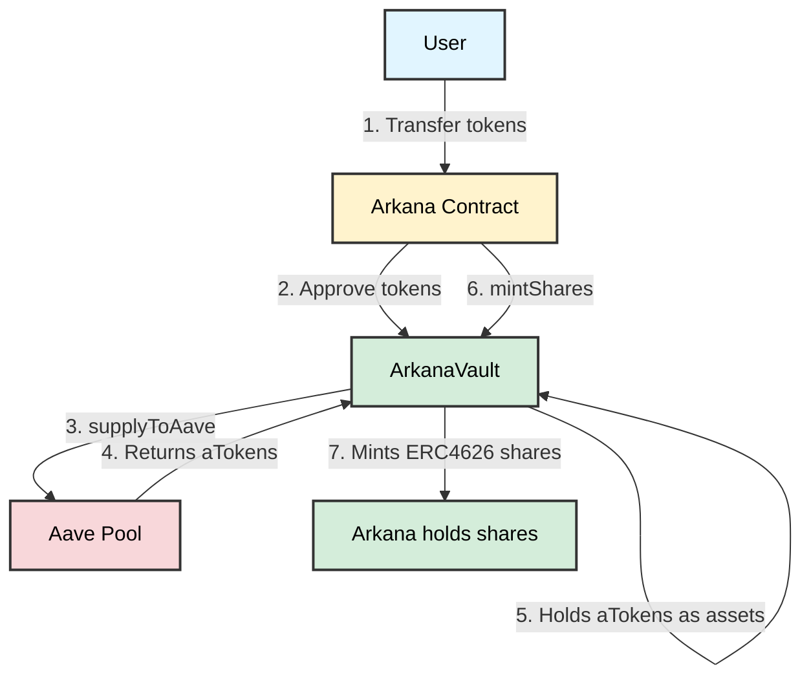
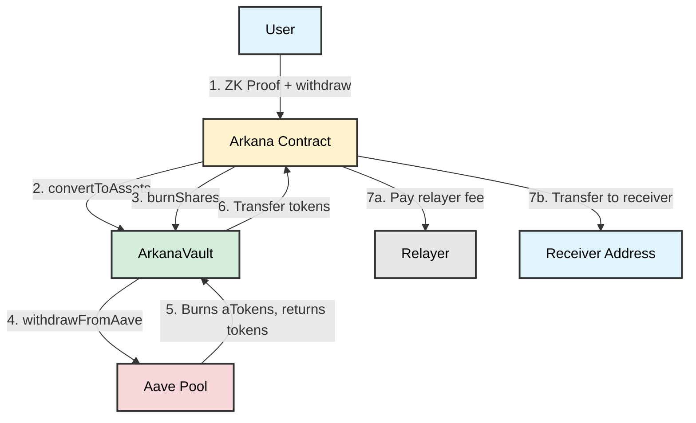
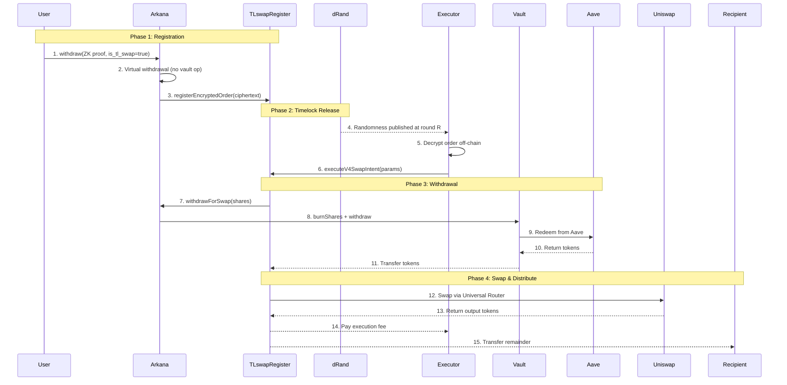
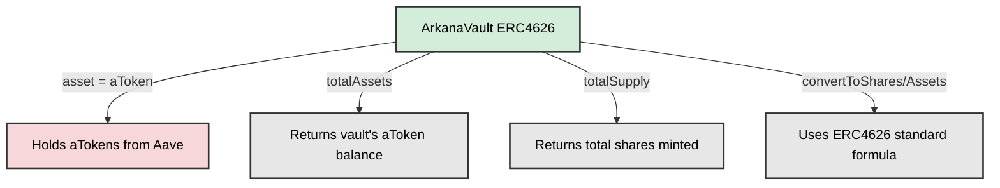
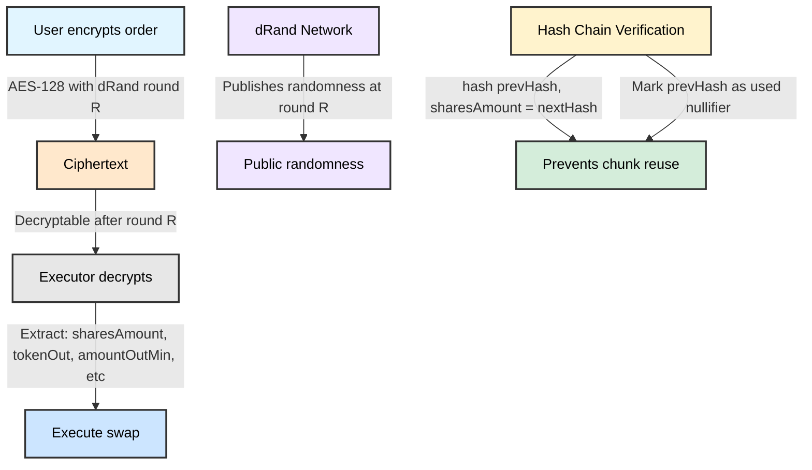

# Arkana

> **⚠️ Hackathon Project Disclaimer**
> 
> This project was built for **EthGlobal MoneyHack2026**. This is a proof-of-concept implementation and **should not be used in production**.
> 
> **Security Warning**: This codebase contains known and potentially unknown vulnerabilities. The code is incomplete and has not undergone comprehensive security audits. Just dont use it!

A privacy-preserving DeFi protocol that enables private deposits, withdrawals, and timelock-encrypted swap operations using zero-knowledge proofs.

## Overview

Arkana is a zero-knowledge privacy protocol built on Ethereum that allows users to:
- **Deposit tokens** with complete privacy using cryptographic commitments
- **Withdraw tokens** without revealing balances or transaction history
- **Execute timelock-encrypted swaps** and liquidity operations that unlock at future dates
- **Earn yield** through Aave integration while maintaining privacy

All operations are verified using zero-knowledge proofs (Noir circuits), ensuring that transaction details remain private while maintaining cryptographic integrity.

## Architecture

### Core Components

#### **Arkana Contract** (`contracts/src/Arkana.sol`)
The main protocol contract that manages:
- **Merkle Tree State**: Uses Poseidon2 hashing to maintain private balance commitments in incremental Merkle trees
- **Zero-Knowledge Verification**: Verifies Noir circuit proofs for entry, deposit, and withdraw operations
- **Vault Management**: Creates and manages ERC4626 vaults for each supported token
- **Aave Integration**: Automatically deposits user funds to Aave for yield generation

#### **ArkanaVault** (`contracts/src/ArkanaVault.sol`)
ERC4626-compliant vaults that:
- Wrap Aave aTokens as vault shares
- Provide standard ERC4626 interface for deposits/withdrawals
- Enable yield generation through Aave while maintaining privacy

#### **TLswapRegister** (`contracts/src/tl-limit/TLswapRegister.sol`)
Registry for timelock-encrypted operations:
- **Timelock Encryption**: Orders encrypted using drand beacons, decryptable only after specific rounds
- **Swap Execution**: Executes swaps via Uniswap V4 Universal Router
- **Liquidity Provision**: Adds liquidity to Uniswap V4 pools
- **Hash Chain Validation**: Ensures order integrity using keccak256 hashes and Poseidon2 hash chains

### Protocol Flow Diagrams

The following diagrams illustrate how the protocol works:

#### Deposit Flow



#### Withdraw Flow



#### Timelock Swap (TL_SWAP) Flow



#### Vault Asset Tracking



#### DRAND Timelock Encryption



### Zero-Knowledge Circuits

The protocol uses Noir circuits for zero-knowledge proof generation:

- **Entry Circuit**: Initializes a new account in the Merkle tree
- **Deposit Circuit**: Proves deposit of tokens without revealing amount
- **Withdraw Circuit**: Proves withdrawal with optional timelock swap operations

All circuits use Poseidon2 hashing for efficient zero-knowledge operations.

## Features

### 🔐 Privacy-Preserving Operations

- **Private Balances**: Your token balances are stored as cryptographic commitments in a Merkle tree
- **Private Transactions**: Deposit and withdrawal amounts are hidden from observers
- **Zero-Knowledge Proofs**: All operations verified using zk-SNARKs without revealing private data

### 💰 Yield Generation

- **Aave Integration**: Deposited tokens are automatically supplied to Aave for yield
- **ERC4626 Vaults**: Standard vault interface for each token
- **Real-time Yield**: Earn interest while maintaining privacy

### ⏰ Timelock Swaps

- **Encrypted Orders**: Create swap or liquidity orders encrypted with drand beacons
- **Future Execution**: Orders unlock at specific drand rounds (time-based)
- **Nested Encryption**: Support for order chains with multiple unlock dates
- **Uniswap V4 Integration**: Direct execution on Uniswap V4 pools

### 🎯 Operation Modes

- **Mage Mode**: Standard mode where each token has its own nonce that increases vertically
- **Archon Mode**: Liquidity provision mode with horizontal `user_key` increments (limited to 2 vertical nonces per key)

## Technical Details

### Cryptographic Primitives

- **Poseidon2**: Used for Merkle tree hashing and commitment generation
- **Baby Jubjub**: Elliptic curve for zero-knowledge address generation
- **BN254**: Elliptic curve for pairing-based cryptography (timelock encryption)
- **Poseidon2 KDF**: Key derivation for AES encryption
- **AES-128-CBC**: Symmetric encryption for order data

### Merkle Tree Structure

- **Incremental Merkle Tree (IMT)**: Lean IMT implementation using Poseidon2
- **Per-Token Trees**: Each token has its own Merkle tree
- **Historical States**: Tracks all tree roots for proof generation
- **Minimum Depth**: All proofs are at least 8 levels deep for security

### Timelock Encryption

Orders are encrypted using:
1. **drand Beacons**: Time-based randomness from drand network
2. **BN254 Pairings**: Cryptographic pairings for timelock verification
3. **AES Encryption**: Symmetric encryption of order parameters
4. **IPFS Storage**: Encrypted orders stored on IPFS

## Getting Started

### Prerequisites

- **Node.js** 18+ and **pnpm**
- **Foundry** (for contract development and testing)
- **Anvil** (local Ethereum node for development)

### Installation

1. Clone the repository:
```bash
git clone <repository-url>
cd evm-arkana-monorepo
```

2. Install dependencies:
```bash
# Frontend
cd frontend
pnpm install

# Contracts
cd ../contracts
forge install
```

3. Set up environment variables:

Create `frontend/.env.local`:
```env
NEXT_PUBLIC_PROJECT_ID=your_reown_project_id
PINATA_API_KEY=your_pinata_api_key
PINATA_SECRET_API_KEY=your_pinata_secret_key
PINATA_JWT=your_pinata_jwt
```

### Running Locally

1. Start Anvil (in a separate terminal):
```bash
anvil
```

2. Deploy contracts:
```bash
cd contracts
./script/anvil_deploy.sh
```

3. Start the frontend:
```bash
cd frontend
pnpm dev
```

4. Open [http://localhost:3000](http://localhost:3000)

## Usage

### Initializing Your Account

1. **Connect Wallet**: Connect your Ethereum wallet using WalletConnect
2. **Sign Sigil**: Sign the Arkana message to generate your zero-knowledge address
3. **Initialize**: Create your first deposit to initialize your account in the Merkle tree

### Depositing Tokens

1. Navigate to the **Rituals** page
2. Select a token and amount
3. Choose **Mage** or **Archon** mode
4. Generate proof and submit transaction
5. Your balance is now privately committed in the Merkle tree

### Withdrawing Tokens

1. Navigate to the **Withdraw** page
2. Select token and amount
3. Choose withdrawal type:
   - **Standard Withdrawal**: Direct withdrawal to an address
   - **Timelock Swap**: Encrypted swap order that unlocks at a future date
   - **Timelock Liquidity**: Encrypted liquidity provision order
4. Generate proof and submit transaction

### Decrypting Timelock Orders

1. Navigate to the **Decrypt** page
2. Select token and nonce
3. The system automatically:
   - Computes the nonce commitment
   - Fetches encrypted order from IPFS
   - Decrypts when the drand round is available
4. Simulate or execute the swap/liquidity operation

## Project Structure

```
evm-arkana-monorepo/
├── contracts/          # Solidity smart contracts
│   ├── src/
│   │   ├── Arkana.sol              # Main protocol contract
│   │   ├── ArkanaVault.sol         # ERC4626 vault implementation
│   │   └── tl-limit/
│   │       └── TLswapRegister.sol  # Timelock swap registry
│   └── test/           # Foundry tests
├── circuits/           # Noir zero-knowledge circuits
│   └── main/
│       ├── entry/      # Account initialization circuit
│       ├── deposit/   # Deposit circuit
│       └── withdraw/  # Withdrawal circuit
├── frontend/           # Next.js frontend application
│   ├── app/            # Next.js app directory
│   │   ├── rituals/   # Deposit/initialize page
│   │   ├── withdraw/  # Withdrawal page
│   │   └── decrypt/   # Order decryption page
│   └── components/    # React components
└── ts-utils/           # TypeScript utilities
```

## Security Considerations

⚠️ **Important**: This is a hackathon project and has not been audited. Do not use with real funds.

- **Private Key Management**: User signatures are used to derive private keys client-side. Never share your signature.
- **Proof Generation**: All proofs are generated client-side. The private key never leaves your device.
- **Hash Chain Validation**: Timelock orders use hash chains to ensure integrity and prevent tampering.
- **Order Integrity**: All order parameters are hashed and validated on-chain before execution.
- **Known Limitations**: The codebase is incomplete and may contain vulnerabilities. Use only for testing and demonstration purposes.

## Development

### Building Contracts

```bash
cd contracts
forge build --via-ir
```

### Running Tests

```bash
cd contracts
forge test --via-ir
```

### Building Circuits

```bash
cd circuits
nargo compile
```

## License

MIT
