# Arkana - DeFi shroud

<p align="center">
  
</p>

> **⚠️ Hackathon Project Disclaimer**
> 
> This project was built for **EthGlobal MoneyHack2026**. This is a proof-of-concept implementation and **should not be used in production**.
> 
> **Security Warning**: This codebase contains known and potentially unknown vulnerabilities. The code is incomplete and has not undergone comprehensive security audits. Just dont use it!

A privacy-preserving DeFi protocol that enables private deposits, withdrawals, and timelock-encrypted swap operations using zero-knowledge proofs.

### Built With

<p align="center">
  <a href="https://aave.com"></a>
  &nbsp;&nbsp;&nbsp;&nbsp;
  <a href="https://drand.love"></a>
  &nbsp;&nbsp;&nbsp;&nbsp;
  <a href="https://uniswap.org"></a>
</p>

## Overview

Arkana is a zero-knowledge privacy protocol built on Ethereum that allows users to:
- **Deposit tokens** with complete privacy using cryptographic commitments
- **Withdraw tokens** without revealing balances or transaction history
- **Execute timelock-encrypted swaps** and liquidity operations that unlock at future dates
- **Earn yield** through Aave integration while maintaining privacy

All operations are verified using zero-knowledge proofs (Noir circuits), ensuring that transaction details remain private while maintaining cryptographic integrity.

## Sepolia Testnet Deployment

The protocol is deployed on Sepolia testnet. You can interact with these contracts:

| Contract | Address | Explorer |
|----------|---------|----------|
| **Arkana** | [`0xdF176aeD11420feE6c58EA18A4C7394Ac34d2f11`](https://sepolia.etherscan.io/address/0xdF176aeD11420feE6c58EA18A4C7394Ac34d2f11) | [View on Etherscan](https://sepolia.etherscan.io/address/0xdF176aeD11420feE6c58EA18A4C7394Ac34d2f11) |
| **TLswapRegister** | [`0x39996274718bE9BA7b4E4072BaB4B188f0d8938D`](https://sepolia.etherscan.io/address/0x39996274718bE9BA7b4E4072BaB4B188f0d8938D) | [View on Etherscan](https://sepolia.etherscan.io/address/0x39996274718bE9BA7b4E4072BaB4B188f0d8938D) |
| **Poseidon2 Huff** | [`0x140A5B14606e6e7CBe8a137371A6796C41691599`](https://sepolia.etherscan.io/address/0x140A5B14606e6e7CBe8a137371A6796C41691599) | [View on Etherscan](https://sepolia.etherscan.io/address/0x140A5B14606e6e7CBe8a137371A6796C41691599) |

### Example Transaction

See a timelock swap operation in action:
- [TL Swap Transaction](https://sepolia.etherscan.io/tx/0x83f5872a3de57f2bd500068b312021397eb5a6ae3c6bc1572a81b46c24599946)

## How It Works

This section explains the core operations of Arkana: depositing, withdrawing, and timelock-encrypted swaps.

---

### 💰 Deposit: Private Entry into the Protocol

When you deposit tokens into Arkana, your funds are privately committed to the protocol while simultaneously being put to work earning yield through Aave.

#### What Happens During Deposit

1. **Generate ZK Proof**: Client-side, you generate a zero-knowledge proof that commits to your deposit without revealing the amount
2. **Verify & Transfer**: The Arkana contract verifies your proof and accepts your tokens
3. **Supply to Aave**: Tokens are immediately supplied to Aave's lending pool
4. **Mint Shares**: You receive ERC4626 vault shares representing your position
5. **Update Merkle Tree**: Your commitment is added to the token's Merkle tree


#### Upfront Fee Structure (Anonymity Preservation)

Arkana charges fees **upfront during deposit**, not during withdrawal. This is a deliberate design choice for privacy.

**The Problem with Withdrawal Fees:**

If fees were deducted at withdrawal:
```
User A withdraws: 100 tokens → receives 99 tokens (1% fee)
User B withdraws: 100 tokens → receives 100 tokens (no fee, LP)

Observer: "User A is a regular user, User B is a liquidity provider!"
```

This leaks information about user roles and **compromises the anonymity set**.

**Arkana's Solution:**

```
Deposit Phase:
━━━━━━━━━━━━━━━━━━━━━━━━━━━━━━━━━━━━━━━━━━━━━━━━━━━━━━━━━
User deposits 100 tokens
  → Protocol takes 1 token fee upfront
  → User receives commitment for 99 shares

Withdrawal Phase:
━━━━━━━━━━━━━━━━━━━━━━━━━━━━━━━━━━━━━━━━━━━━━━━━━━━━━━━━━
All users withdraw shares → receive full share value
  → Regular user: 99 shares → 99+ tokens (with yield)
  → LP user: 99 shares → 99+ tokens (with yield)

Observer sees: identical withdrawal patterns!
```

By taking fees upfront, all withdrawals look identical and observers cannot distinguish regular users from liquidity providers.

#### Vault Asset Tracking

The vault uses the ERC4626 standard to track shares and assets:


---

### 🔓 Withdraw: Private Exit from the Protocol

Standard withdrawals allow you to exit the protocol and receive your tokens (plus any accrued yield) without revealing your balance or transaction history.

#### What Happens During Withdrawal

1. **Generate ZK Proof**: Prove you own a valid commitment in the Merkle tree
2. **Verify Proof**: Contract verifies without learning your identity or balance
3. **Burn Shares**: Your vault shares are burned
4. **Redeem from Aave**: Underlying tokens are withdrawn from Aave
5. **Transfer Tokens**: Tokens sent to your chosen recipient
6. **Mark Nullifier**: Your nullifier is marked as spent to prevent double-spending


---

### ⏰ Timelock Swaps: Future-Dated Private DeFi Operations

Timelock swaps are Arkana's most powerful feature—they allow you to commit to future swaps or liquidity operations that remain encrypted until a specific time, preventing front-running and information asymmetry.

#### Why Timelock Encryption?

In traditional DeFi, when you submit a swap intent:
- MEV bots see your pending transaction
- Market makers can front-run your order
- Your trading strategy is exposed

With Arkana's timelock encryption:
- Your order is encrypted until a future time
- No one (not even the protocol) knows your intent
- Orders execute atomically when decrypted

#### The Timelock Swap Flow


#### How drand Timelock Encryption Works

The [drand network](https://drand.love) is a distributed randomness beacon that publishes unpredictable, verifiable randomness at regular intervals (every 3 seconds). Each "round" has:
- A **round number** (monotonically increasing)
- A **public key** (known in advance)
- A **signature** (only revealed when the round is reached)

```mermaid
sequenceDiagram
    participant U as User
    participant D as dRand Network
    participant E as Executor
    participant T as TLswapRegister

    Note over U,D: Encryption Phase (before round R)
    U->>U: 1. Generate order params
    U->>U: 2. Encrypt with dRand round R public key
    U->>T: 3. Submit ciphertext on-chain

    Note over D,E: Timelock Release (at round R)
    D->>D: 4. Generate randomness for round R
    D-->>E: 5. Publish randomness
    E->>E: 6. Decrypt ciphertext using randomness

    Note over E,T: Verification & Execution
    E->>T: 7. Submit decrypted params
    T->>T: 8. Verify hash chain (prevHash → nextHash)
    T->>T: 9. Mark prevHash as used nullifier
    T->>T: 10. Execute swap with params
```



We encrypt order data using BN254 pairing-based Identity-Based Encryption (IBE):

1. **Encryption (before target round)**:
   - User selects a future drand round `R` as the unlock time
   - Using the drand network's public key and round `R` as identity, derive an ephemeral encryption key
   - Encrypt order parameters with AES-128-CBC using this key
   - The ciphertext is decryptable only when round `R`'s signature is published

2. **Decryption (at or after target round)**:
   - drand publishes randomness (signature) for round `R`
   - Anyone can now derive the decryption key and decrypt the order
   - Executor decrypts and executes the swap on-chain

#### Ciphertext Composition

Each encrypted order package contains:

```
┌─────────────────────────────────────────────────────────────┐
│                    Encrypted Order Package                   │
├─────────────────────────────────────────────────────────────┤
│  Target Round: 13444182                                      │
│  ───────────────────────────────────────────────────────────│
│  Ciphertext (BN254 IBE encrypted):                          │
│    ├─ U (G1 point): ephemeral public key                    │
│    ├─ V (bytes): encrypted symmetric key                    │
│    └─ W (bytes): AES-128-CBC encrypted order data           │
│  ───────────────────────────────────────────────────────────│
│  Decrypted Order Parameters:                                │
│    ├─ sharesAmount: amount of vault shares to swap          │
│    ├─ amountOutMin: minimum output for slippage protection  │
│    ├─ tokenIn / tokenOut: swap pair                         │
│    ├─ recipient: where output tokens go                     │
│    ├─ deadline: transaction deadline                        │
│    ├─ prevHash / nextHash: hash chain anchors               │
│    └─ executionFeeBps: fee for executor                     │
└─────────────────────────────────────────────────────────────┘
```

#### Virtual Withdrawal & Order Chunking

A key privacy feature: **large orders are split into smaller chunks** executed over time.

**Example**: Alice wants to swap 1 ETH worth of shares:

```
Traditional Approach:          Arkana TL Swap Approach:
━━━━━━━━━━━━━━━━━━━━━         ━━━━━━━━━━━━━━━━━━━━━━━━━━━━━━━━
                              
Withdraw 1 ETH →              Virtual Withdrawal (ZK proof):
Everyone sees 1 ETH           - 1 ETH deducted from balance
leaving the pool              - NO tokens leave Arkana yet
                              - Shares locked for TL orders
                              
                              Encrypted Order Chain:
                              ┌─────────────────────────────┐
                              │ Order 1: 0.1 ETH @ Round R  │
                              │ Order 2: 0.1 ETH @ Round R+1│
                              │ Order 3: 0.1 ETH @ Round R+2│
                              │ ...                         │
                              │ Order 10: 0.1 ETH @ Round R+9│
                              └─────────────────────────────┘
                              
                              Execution (over time):
                              → Only 0.1 ETH visible per tx
                              → Different times, recipients
                              → Observers can't link orders
```

This architecture means **Arkana retains the funds until each order executes**, so observers never see a large withdrawal—only small, unlinkable swap executions over time.

#### Hash Chain for Order Integrity

The hash chain mechanism ensures that encrypted order chunks are executed in the correct order, prevents double-spending, and validates that all chunks sum to the total withdrawn amount.

```mermaid
flowchart TD
    subgraph Circuit["🔐 Withdraw Circuit (ZK Proof Generation)"]
        UK[user_key] --> IH
        PN[previous_nonce] --> IH
        IH["initial_hash = Poseidon2(user_key, previous_nonce)"]
        
        IH --> H0
        TA[total_amount] --> H0
        H0["h₀ = Poseidon2(initial_hash, total_amount)"]
        
        H0 --> H1
        S1["shares₁"] --> H1
        H1["h₁ = Poseidon2(h₀, shares₁)"]
        
        H1 --> H2
        S2["shares₂"] --> H2
        H2["h₂ = Poseidon2(h₁, shares₂)"]
        
        H2 --> H3
        S3["shares₃"] --> H3
        H3["h₃ = Poseidon2(h₂, shares₃)"]
        
        H3 --> HN
        HN["... hₙ = final_hashchain"]
        
        SUM["Σ sharesᵢ == total_amount ✓"]
    end
    
    subgraph Contract["📜 TLswapRegister (On-Chain Verification)"]
        direction TB
        
        subgraph Exec1["Execute Chunk 1"]
            PH1["prevHash = h₀"]
            SA1["sharesAmount = shares₁"]
            NH1["nextHash = h₁"]
            V1["Verify: Poseidon2(h₀, shares₁) == h₁ ✓"]
            M1["Mark h₀ as USED"]
        end
        
        subgraph Exec2["Execute Chunk 2"]
            PH2["prevHash = h₁"]
            SA2["sharesAmount = shares₂"]
            NH2["nextHash = h₂"]
            V2["Verify: Poseidon2(h₁, shares₂) == h₂ ✓"]
            M2["Mark h₁ as USED"]
        end
        
        subgraph Exec3["Execute Chunk 3"]
            PH3["prevHash = h₂"]
            SA3["sharesAmount = shares₃"]
            NH3["nextHash = h₃"]
            V3["Verify: Poseidon2(h₂, shares₃) == h₃ ✓"]
            M3["Mark h₂ as USED"]
        end
    end
    
    HN -.->|"Published in ZK proof"| Contract
    
    style Circuit fill:#1a1a2e,stroke:#0f3460,color:#e94560
    style Contract fill:#0f3460,stroke:#1a1a2e,color:#eee
    style Exec1 fill:#16213e,stroke:#e94560,color:#fff
    style Exec2 fill:#16213e,stroke:#e94560,color:#fff
    style Exec3 fill:#16213e,stroke:#e94560,color:#fff
```



**Hash Chain Security Properties:**

```mermaid
flowchart LR
    subgraph Properties["🛡️ Security Guarantees"]
        direction TB
        
        P1["<b>1. Order Integrity</b><br/>Each chunk's hash depends on<br/>all previous chunks"]
        P2["<b>2. No Double-Spend</b><br/>prevHash marked as USED<br/>after execution"]
        P3["<b>3. Amount Validation</b><br/>Circuit proves:<br/>Σ chunks = total_amount"]
        P4["<b>4. Sequence Enforcement</b><br/>Can't skip or reorder<br/>chunks in the chain"]
    end
    
    subgraph Example["📋 Example: 100 shares → 3 chunks"]
        direction TB
        E1["Chunk 1: 30 shares"]
        E2["Chunk 2: 20 shares"]
        E3["Chunk 3: 50 shares"]
        E4["Total: 100 shares ✓"]
        
        E1 --> E2 --> E3 --> E4
    end
    
    Properties --> Example
    
    style Properties fill:#1a1a2e,stroke:#e94560,color:#fff
    style Example fill:#0f3460,stroke:#16213e,color:#fff
```



**Attack Prevention:**

| Attack Vector | Prevention Mechanism |
|--------------|----------------------|
| Replay chunk | `usedHashChainNodes[prevHash]` check prevents reuse |
| Modify amount | Hash chain breaks: `Poseidon2(prevHash, wrongAmount) ≠ expectedNextHash` |
| Skip chunks | Missing prevHash not marked as used, chain breaks |
| Reorder chunks | Hash depends on sequence: `h₂ = Poseidon2(h₁, s₂)` requires `h₁` first |
| Inflate total | ZK circuit enforces: `Σ sharesᵢ == total_amount` |

---

## Architecture

### Core Components

#### **Arkana Contract** (`contracts/src/Arkana.sol`)
The main protocol contract that manages:
- **Merkle Tree State**: Uses Poseidon2 hashing to maintain private balance commitments in incremental Merkle trees
- **Zero-Knowledge Verification**: Verifies Noir circuit proofs for entry, deposit, and withdraw operations
- **Vault Management**: Creates and manages ERC4626 vaults for each supported token
- **Aave Integration**: Automatically deposits user funds to Aave for yield generation

#### **ArkanaVault** (`contracts/src/ArkanaVault.sol`)
ERC4626-compliant vaults that:
- Wrap Aave aTokens as vault shares
- Provide standard ERC4626 interface for deposits/withdrawals
- Enable yield generation through Aave while maintaining privacy

#### **TLswapRegister** (`contracts/src/tl-limit/TLswapRegister.sol`)
Registry for timelock-encrypted operations:
- **Timelock Encryption**: Orders encrypted using drand beacons, decryptable only after specific rounds
- **Swap Execution**: Executes swaps via Uniswap V4 Universal Router
- **Liquidity Provision**: Adds liquidity to Uniswap V4 pools
- **Hash Chain Validation**: Ensures order integrity using keccak256 hashes and Poseidon2 hash chains

### Zero-Knowledge Circuits

The protocol uses Noir circuits for zero-knowledge proof generation:

- **Entry Circuit**: Initializes a new account in the Merkle tree
- **Deposit Circuit**: Proves deposit of tokens without revealing amount
- **Withdraw Circuit**: Proves withdrawal with optional timelock swap operations

All circuits use Poseidon2 hashing for efficient zero-knowledge operations.

## Technical Details

### Cryptographic Primitives

- **Poseidon2**: Used for Merkle tree hashing and commitment generation
- **Baby Jubjub**: Elliptic curve for zero-knowledge address generation
- **BN254**: Elliptic curve for pairing-based cryptography (timelock encryption)
- **Poseidon2 KDF**: Key derivation for AES encryption
- **AES-128-CBC**: Symmetric encryption for order data

### Merkle Tree Structure

- **Incremental Merkle Tree (IMT)**: Lean IMT implementation using Poseidon2
- **Per-Token Trees**: Each token has its own Merkle tree
- **Historical States**: Tracks all tree roots for proof generation
- **Minimum Depth**: All proofs are at least 8 levels deep for security

### Split Pedersen Commitment (Hybrid Circuit/Contract Computation)

Arkana uses a unique split approach for Pedersen commitments where half the computation happens in the ZK circuit and half happens on-chain via Grumpkin curve point addition.

#### Why Split the Commitment?

Traditional approach: Compute entire commitment inside the circuit
```
commitment = Pedersen(secret, amount, nonce, token, ...)
```

**Problem**: Full Pedersen inside Noir circuits is expensive (many constraints) and inflexible—any change to committed fields requires circuit recompilation.

Arkana's approach: Split computation using elliptic curve homomorphism

```
Circuit Side (private):           Contract Side (public):
━━━━━━━━━━━━━━━━━━━━━━━          ━━━━━━━━━━━━━━━━━━━━━━━━━━
                                 
partial_commit =                 full_commit = 
  Pedersen(secret, nonce)          partial_commit ⊕ 
                                   Pedersen(amount, token, ...)
                                 
Private values stay              Public values added on-chain
inside the circuit               using Grumpkin point addition
```

#### How It Works

1. **In the ZK Circuit** (private values):
   ```noir
   // User's secret key and nonce → partial commitment point
   let partial = pedersen([user_secret, nonce]);
   ```

2. **On-Chain** (public values):
   ```solidity
   // Add public values using Grumpkin curve point addition
   // partial_point + amount_point + token_point = full_commitment
   bytes32 fullCommit = GrumpkinAdd(partialCommit, publicPart);
   ```

3. **Security**: 
   - The partial commitment hides `user_secret` and `nonce` (ZK proof)
   - Grumpkin's discrete log problem ensures you can't reverse-engineer private values
   - Point addition is binding: `A + B = C` means changing any input changes output

This approach reduces circuit complexity by ~40% while maintaining the same security guarantees.

## Features

### 🔐 Privacy-Preserving Operations

- **Private Balances**: Your token balances are stored as cryptographic commitments in a Merkle tree
- **Private Transactions**: Deposit and withdrawal amounts are hidden from observers
- **Zero-Knowledge Proofs**: All operations verified using zk-SNARKs without revealing private data

### 💰 Yield Generation

- **Aave Integration**: Deposited tokens are automatically supplied to Aave for yield
- **ERC4626 Vaults**: Standard vault interface for each token
- **Real-time Yield**: Earn interest while maintaining privacy

### ⏰ Timelock Swaps

- **Encrypted Orders**: Create swap or liquidity orders encrypted with drand beacons
- **Future Execution**: Orders unlock at specific drand rounds (time-based)
- **Nested Encryption**: Support for order chains with multiple unlock dates
- **Uniswap V4 Integration**: Direct execution on Uniswap V4 pools

### 🎯 Operation Modes

- **Mage Mode**: Standard mode where each token has its own nonce that increases vertically
- **Archon Mode**: Liquidity provision mode with horizontal `user_key` increments (limited to 2 vertical nonces per key)

## Getting Started

### Prerequisites

- **Node.js** 18+ and **pnpm**
- **Foundry** (for contract development and testing)
- **Anvil** (local Ethereum node for development)

### Installation

1. Clone the repository:
```bash
git clone <repository-url>
cd evm-arkana-monorepo
```

2. Install dependencies:
```bash
# Frontend
cd frontend
pnpm install

# Contracts
cd ../contracts
forge install
```

3. Set up environment variables:

Create `frontend/.env.local`:
```env
# Required
NEXT_PUBLIC_PROJECT_ID=your_reown_project_id

# Optional: Set to "true" or "1" to use Sepolia instead of Anvil
NEXT_PUBLIC_IS_SEPOLIA=false

# Optional: Custom RPC URLs (defaults provided if not set)
NEXT_PUBLIC_SEPOLIA_RPC_URL=https://ethereum-sepolia-rpc.publicnode.com
NEXT_PUBLIC_ANVIL_RPC_URL=http://127.0.0.1:8545

# IPFS (for timelock orders)
PINATA_API_KEY=your_pinata_api_key
PINATA_SECRET_API_KEY=your_pinata_secret_key
PINATA_JWT=your_pinata_jwt
```

For contracts deployment, create `contracts/.env`:
```env
# Set to "true" or "1" to deploy to Sepolia
IS_SEPOLIA=false

# Sepolia RPC URL (required if IS_SEPOLIA=true)
SEPOLIA_RPC_URL=https://ethereum-sepolia-rpc.publicnode.com

# Etherscan API key (required for contract verification on Sepolia)
ETHERSCAN_API_KEY=your_etherscan_api_key

# Sepolia token addresses (optional, defaults provided)
SEPOLIA_AAVE_POOL=0x6Ae43d3271ff6888e7Fc43Fd7321a503ff738951
SEPOLIA_POOL_MANAGER=0xE03A1074c86CFeDd5C142C4F04F1a1536e203543
# ... (see script for full list)
```

### Running Locally

1. Start Anvil (in a separate terminal):
```bash
anvil
```

2. Deploy contracts:

For local Anvil (default):
```bash
cd contracts
./script/anvil_deploy.sh
```

For Sepolia testnet:
```bash
cd contracts
IS_SEPOLIA=true ETHERSCAN_API_KEY=your_key ./script/anvil_deploy.sh
```

3. Start the frontend:
```bash
cd frontend
pnpm dev
```

4. Open [http://localhost:3000](http://localhost:3000)

## Usage

### Initializing Your Account

1. **Connect Wallet**: Connect your Ethereum wallet using WalletConnect
2. **Sign Sigil**: Sign the Arkana message to generate your zero-knowledge address
3. **Initialize**: Create your first deposit to initialize your account in the Merkle tree

### Depositing Tokens

1. Navigate to the **Rituals** page
2. Select a token and amount
3. Choose **Mage** or **Archon** mode
4. Generate proof and submit transaction
5. Your balance is now privately committed in the Merkle tree

### Withdrawing Tokens

1. Navigate to the **Withdraw** page
2. Select token and amount
3. Choose withdrawal type:
   - **Standard Withdrawal**: Direct withdrawal to an address
   - **Timelock Swap**: Encrypted swap order that unlocks at a future date
   - **Timelock Liquidity**: Encrypted liquidity provision order
4. Generate proof and submit transaction

### Decrypting Timelock Orders

1. Navigate to the **Decrypt** page
2. Select token and nonce
3. The system automatically:
   - Computes the nonce commitment
   - Fetches encrypted order from IPFS
   - Decrypts when the drand round is available
4. Simulate or execute the swap/liquidity operation

## Project Structure

```
evm-arkana-monorepo/
├── contracts/          # Solidity smart contracts
│   ├── src/
│   │   ├── Arkana.sol              # Main protocol contract
│   │   ├── ArkanaVault.sol         # ERC4626 vault implementation
│   │   └── tl-limit/
│   │       └── TLswapRegister.sol  # Timelock swap registry
│   └── test/           # Foundry tests
├── circuits/           # Noir zero-knowledge circuits
│   └── main/
│       ├── entry/      # Account initialization circuit
│       ├── deposit/   # Deposit circuit
│       └── withdraw/  # Withdrawal circuit
├── frontend/           # Next.js frontend application
│   ├── app/            # Next.js app directory
│   │   ├── rituals/   # Deposit/initialize page
│   │   ├── withdraw/  # Withdrawal page
│   │   └── decrypt/   # Order decryption page
│   └── components/    # React components
└── ts-utils/           # TypeScript utilities
```

## Security Considerations

⚠️ **Important**: This is a hackathon project and has not been audited. Do not use with real funds.

- **Private Key Management**: User signatures are used to derive private keys client-side. Never share your signature.
- **Proof Generation**: All proofs are generated client-side. The private key never leaves your device.
- **Hash Chain Validation**: Timelock orders use hash chains to ensure integrity and prevent tampering.
- **Order Integrity**: All order parameters are hashed and validated on-chain before execution.
- **Known Limitations**: The codebase is incomplete and may contain vulnerabilities. Use only for testing and demonstration purposes.

## Development Commands

### Circuits Development

#### Prerequisites

- **Noir**: Version `1.0.13-beta` must be installed
  ```bash
  # Install Noir (check https://noir-lang.org for latest instructions)
  ```

#### Compiling Circuits

To compile a specific circuit package:

```bash
cd circuits
nargo check --overwrite --package <PackageName>
```

For example:
```bash
nargo check --overwrite --package entry
nargo check --overwrite --package deposit
nargo check --overwrite --package withdraw
```

#### Testing Circuits

To run tests for a circuit package:

```bash
nargo test --package <PackageName> --show-output
```

#### Building All Circuits and Exporting Verifiers

To build all circuits and export verifiers from `./scripts`:

```bash
cd circuits
./update_prover_toml.sh && ./build_verifiers.sh
```

This will:
- Update the prover configuration files
- Build all verifier contracts
- Export them to the contracts directory

---

### Contracts Development

#### Prerequisites

1. **Foundry**: Install Foundry (see [Foundry Book](https://book.getfoundry.sh/getting-started/installation))

2. **Install Dependencies**:
   ```bash
   cd contracts
   forge install
   pnpm install  # For zkit and other TypeScript dependencies
   ```

3. **Huff**: Install Huff compiler (required for Poseidon2 contract)
   ```bash
   # Install Huff (check https://huff.sh for installation instructions)
   ```

#### Building Contracts

```bash
cd contracts
forge build --via-ir
```

#### Running Tests

Tests are configured to fork from Sepolia. You need to run Anvil with a fork first:

1. **Start Anvil with Sepolia fork** (in a separate terminal):
   ```bash
   anvil --fork-url <SEPOLIA_RPC_URL> --chain-id 31337 --gas-limit 30000000
   ```
   
   ⚠️ **Important**: The `--chain-id 31337` flag is required to override the default chain ID.

2. **Run tests**:
   ```bash
   cd contracts
   forge test --via-ir --skip src/Verifiers/**.sol src/merkle/LeanIMTPoseidon2.sol
   ```

   The `--skip` flag is necessary because verifiers and the Merkle tree library are large contracts that don't need to be compiled for most tests.

#### Deploying to Anvil

1. **Deploy contracts**:
   ```bash
   cd contracts
   ./script/anvil_deploy.sh
   ```

2. **Fund test accounts**:
   ```bash
   ./script/fund_anvil.sh
   ```

   By default, this funds the address `0x1b756A927EF0D4849025887f520be10a5A9137c1`. To fund a different address:
   ```bash
   TARGET=0xYourAddress ./script/fund_anvil.sh
   ```

   ⚠️ **Note**: USDC, EURS, and DAI have supply caps on Aave. For testing, it's recommended to use WBTC or WETH instead, which don't have supply caps.

#### Testing with Forked Sepolia

The test suite creates a fork at `localhost:8545`. Make sure Anvil is running with the fork configuration before running tests:

```bash
# Terminal 1: Start Anvil fork
anvil --fork-url https://ethereum-sepolia-rpc.publicnode.com --chain-id 31337 --gas-limit 30000000

# Terminal 2: Run tests
cd contracts
forge test --via-ir --skip src/Verifiers/**.sol src/merkle/LeanIMTPoseidon2.sol
```

## Frontend Application

> **⚠️ Demo Application**: The frontend is a demonstration interface only. It is not production-ready and should be used solely for testing and exploring the protocol's capabilities.

For a production deployment, consider:
- Using a private RPC endpoint to prevent transaction observation
- Implementing a robust relayer/executor service (ideally as a provided service to avoid race conditions and wasted gas)
- Using IndexedDB or a more robust local storage solution for state management
- The executor should have a designated role to prevent frontrunning of timelock orders

---

## Development Roadmap & TODO

### Circuit Development
- [ ] Complete circuits for `absorb → send` operation flow
- [ ] Complete circuits for `absorb → withdraw` operation flow

### Contract Improvements
- [ ] Add whitelist functionality (currently removed to bootstrap tests)
- [ ] Refactor main contract to use delegate calls to avoid the 24kb contract size limit
- [ ] Implement ECDSA/EdDSA signature validation for user authentication
- [ ] Review and audit the share-to-asset conversion ratio logic

### Protocol Features
- [ ] Integrate peer-to-peer (P2P) private transfers between users
- [ ] Reintegrate timelock-enforced encryption from `feat/DrandExperiment` branch
  - Links should always be revealed on Multicall3 for transparency
  - Execution should be traceable to prevent abuse
- [ ] Handle Aave `supplyCap()` limits gracefully
  - Current issue: if supply cap is hit, try-catch still mints shares
  - Need solution to prevent dilution of LP income when cap is reached

### Infrastructure
- [ ] Implement production-grade relayer/executor model
  - Executors should have designated roles
  - Prevent race conditions on TL order execution
  - Avoid wasted gas from failed executions
- [ ] Migrate from localStorage to IndexedDB for robust state persistence
- [ ] Set up private RPC endpoints for production use

### Security & Auditing
- [ ] Complete security audit of all circuits
- [ ] Complete security audit of all contracts
- [ ] Formal verification of hash chain logic
- [ ] Review nullifier generation for potential collision attacks

---

## License

MIT
